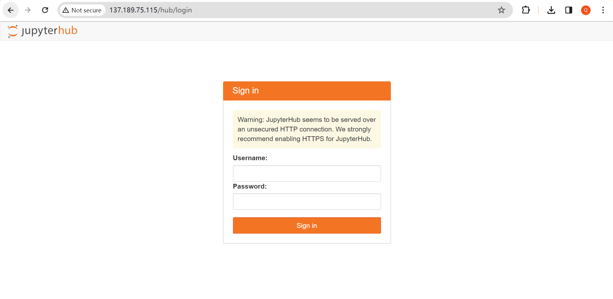
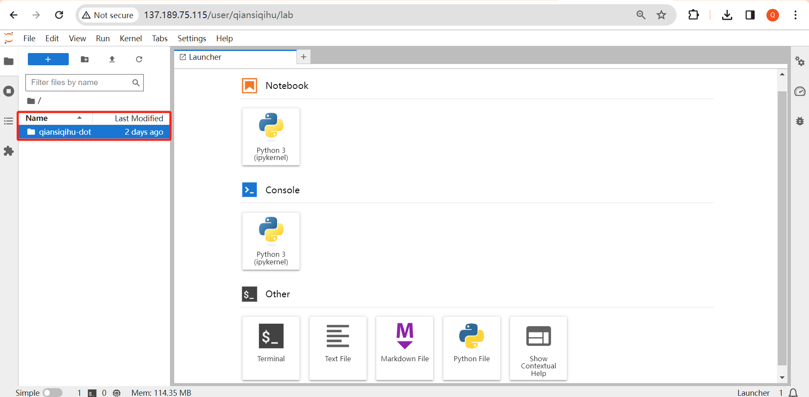

# CUHK Business School DOT-Server

[[**Create an Account**](https://docs.google.com/forms/d/e/1FAIpQLSeT2iQ311o1I-IW_9hPJ3kP0iEuOM8kqR8Lfs-KphaNBxeGvQ/viewform?usp=sf_link)] [[**Report an Issue**](https://docs.google.com/forms/d/e/1FAIpQLSfEhb-JFyDJY4YJZTm_8JhlqI9xnspSksopMaF1Cem5TAclyw/viewform?usp=sf_link)] [[**Deposit Datasets on CUHK Data Repository**](https://github.com/qcbegin/cuhkbiz-data-repo-guide)]


> **Latest Update on Server Status:**
>
> [January 20, 2025]
> The server (137.189.75.115) has been successfully restored. All services are up and running.
> [January 18, 2025]
> IP address 137.189.75.115 is currently inaccessible from campus network (both browser and SSH connections affected). We are working with IT staff to identify and > resolve the connectivity issue. We will notify all users once service is restored.


---

This repository provides an overview of servers in the Department of Decisions, Operations and Technology, CUHK Business School, including two GPU servers (IP addresses: 137.189.75.114 and 137.189.75.115) and one Storage server (IP address: 137.189.75.113). Guidelines on how to use these servers are also introduced.

> IMPORTANT: During the pilot run, we will only open **137.189.75.115** to new users. System integration of both GPU servers is in progress, and all users will be notified when the upgrade is complete.
>
> For now, only the faculty and PhD Students of the Department of Decisions, Operations and Technology are allowed to apply for an account. If you are a CUHK affiliate, please ask your collaborating faculty of the DOT department to apply for an account on your behalf.

In principle, the base environments of the users are independent from each other, and hence you can install libraries according to your own needs. If you find any problems regarding the management of libraries and packages, please contact the administrator via [this link](https://docs.google.com/forms/d/e/1FAIpQLSfEhb-JFyDJY4YJZTm_8JhlqI9xnspSksopMaF1Cem5TAclyw/viewform?usp=sf_link), where users can report issues/submit your customized requests regarding server functions. We will also update a [document](https://github.com/QiansiqiHu/DOT-server/blob/main/Jupyter_env.pdf) to keep track of installation-related issues and their corresponding solutions.

## Configuration

#### GPU Servers (137.189.75.114 & 137.189.75.115)

These two servers are equipped with graphics cards (NVIDIA 4090). You may use them for computational experiments. Below is the summary of these two servers. They are identical in configuration. 

> Currently, ONLY 115 is open to registered users.

|Component| Description|
|---------|------------|
|Operating System       |Ubuntu 22.04.4 LTS|
|RAM                    |32GB DDR5-4800 ECC RDIMM [x16]|
|CPU|Intel® Xeon® Gold 5416S 30M Cache, 2.00 GHz (16C32T) [x2]|
|GPU|NVIDIA GeForce RTX 4090 24GB (CUDA 16,384 / Tensor 512) [x8]|
|Storage|Hard Disk Drive [18TB x8] on 137.189.75.113|

#### Storage Server (137.189.75.113)

This server is used for data storage. You will NOT have direct access to this server, but your data will be automatically stored in its hard disks.

|Component| Description|
|---------|------------|
|Hard Disk Drive|18TB SAS 12Gb/s 7.2K rpm Seagate Enterprise [x8]|

## Supported Software

| Software | Jupyter Notebook | Console | Desktop Interface |
| -------- | ---------------- | ------- | ----------------- |
| Python   | Yes              | Yes     | -                 |
| R        | Yes              | Yes     | No                |
| Stata    | Yes              | -       | No                |
| MATLAB   | No               | No      | No                |

### Python and R

Python is fully supported on our GPU servers and ready to use immediately through either Jupyter Notebook or command line interface. R is also available to all registered users through the same interfaces, though it requires a brief one-time configuration during your first use (See step 3 in the below subsection **"Method 1. Web Access"**). 

### Stata (Limited Availability)

We currently provide Stata access through Jupyter Notebook with some important limitations. Our license only supports 5 concurrent users, and the Jupyter integration offers a more basic experience compared to desktop Stata - notably missing the integrated data viewer and command history features. Due to these limitations, we recommend Stata access primarily for users who are already comfortable using Stata through Jupyter Notebook.


If you would like to use Stata, please submit your request through [our form](https://docs.google.com/forms/d/e/1FAIpQLSfEhb-JFyDJY4YJZTm_8JhlqI9xnspSksopMaF1Cem5TAclyw/viewform?usp=sf_link) explaining your specific need. Access is granted on a first-come, first-served basis. Once approved, you can follow our [nbstata guide](https://github.com/QiansiqiHu/DOT-server/blob/main/Stata_guide.pdf) for instructions. We are monitoring demand and may upgrade our license if needed.

### Additional Software Requests

If you need access to other software packages (such as `MATLAB`), please submit your request through [our form](https://docs.google.com/forms/d/e/1FAIpQLSfEhb-JFyDJY4YJZTm_8JhlqI9xnspSksopMaF1Cem5TAclyw/viewform?usp=sf_link). We regularly review all software requests to better accommodate our users' research needs.

## Access to Server

### Account Registration

To access our GPU servers, simply complete our [**registration form**](https://docs.google.com/forms/d/e/1FAIpQLSeT2iQ311o1I-IW_9hPJ3kP0iEuOM8kqR8Lfs-KphaNBxeGvQ/viewform?usp=sf_link). You'll receive your login credentials via email once your registration is approved.

### Network Prerequisite

Please make sure that the internet cable (in CYT) is available at your workplace OR that you have connected onto the [CUHK VPN service](https://www.itsc.cuhk.edu.hk/all-it/wifi-and-network/cuhk-vpn/). Otherwise, you will NOT be able to connect to the server for safety reasons.

If you're accessing the server from mainland China, you'll need the CUHK add-on VPN service for a stable connection. You can request this service through [this link](https://cuhk-edt.knowledgeowl.com/docs/pilot-cuhk-vpn-add-on-service). After approval, you'll receive an email with a specific portal address - use this instead of the standard VPN portal (access.cuhk.edu.hk).

### Method 1. Web Access

Using Jupyter requires no special software other than a browser. Follow the below steps to start your journey with sufficient GPU resources.

1. First, input `137.189.75.115` on your web server, and you will be guided to the following page:



2. Then input the username that you have received from the email sent by the server administrator, and **create a password by yourself**. (Please note that the password you create will be used for every future login, so you need to remember it). Click "Launch Server", then you will be guided to the JupyterLab interface. Below is an example:



> **IMPORTANT**: Please ensure that you have access to the folder named `yourusername-dot` (as marked in the screenshot above), and perform all experiments and data storage within it. This folder is mounted to remote hard disks, enabling users to enjoy ample storage space. 

3. `R` has also been installed on the servers. You can access `R` kernels by running the following command in terminal.

```
R                               ## start R programming

IRkernel::installspec()         ## install R kernel
```

Quit R with `q()` and initiate a new launcher, you will find that the R kernel is available:


4. With everything prepared, now you can start coding with GPU on the servers! 

### Method 2. SSH

SSH connection offers the most powerful and flexible way to work with our GPU servers, especially for computationally-intensive research projects. To connect, you'll use the username and password from your registration confirmation email. The connection method you choose depends on your comfort level:

- For Beginners: We recommend using VSCode, which provides a familiar graphical interface while maintaining all the benefits of SSH connection. It lets you edit code, manage files, and monitor your programs through a single window.
- For Advanced Users: Command-line SSH gives you complete control over your server environment and may be more efficient for experienced users.

See our detailed [SSH connection guide](https://github.com/QiansiqiHu/DOT-server/blob/main/SSH_access.pdf) for step-by-step instructions for both methods.

## File Transfer: How to upload and download files from our server?

### Using JupyterHub (Beginner-Friendly)

When using JupyterHub's web interface, file transfer is straightforward:

- To upload: Simply drag and drop files from your computer into the JupyterHub file browser
- To download: Right-click on any file and select 'Download'

### Using SSH Commands (Command Line)

For larger files or batch transfers, SSH commands provide efficient file transfer:

```bash
# Upload a file from your computer to the server
scp /path/to/local/file username@137.189.75.115:/path/on/server

# Upload an entire folder
scp -r /path/to/local/folder username@137.189.75.115:/path/on/server

# Download a file from server to your computer
scp username@137.189.75.115:/path/on/server/file /path/on/your/computer

# Examples:
scp data.csv xinyuli@137.189.75.115:/home/xinyuli/datafolder
scp -r codes/ xinyuli@137.189.75.115:/home/xinyuli/project/
```

> *Note: Replace 'username' and 'server' with your actual login credentials and server address.*

### Alternative Methods

- **WinSCP**: A user-friendly graphical tool for Windows users that provides drag-and-drop file transfer
- **Downloading from Web**: To download files directly to the server, use the `wget` command:

```bash
wget https://example.com/dataset.zip
```

## Contact

If you have any additional questions about the DOT-Server of CUHK Business School, please contact us at dotserver@cuhk.edu.hk.

