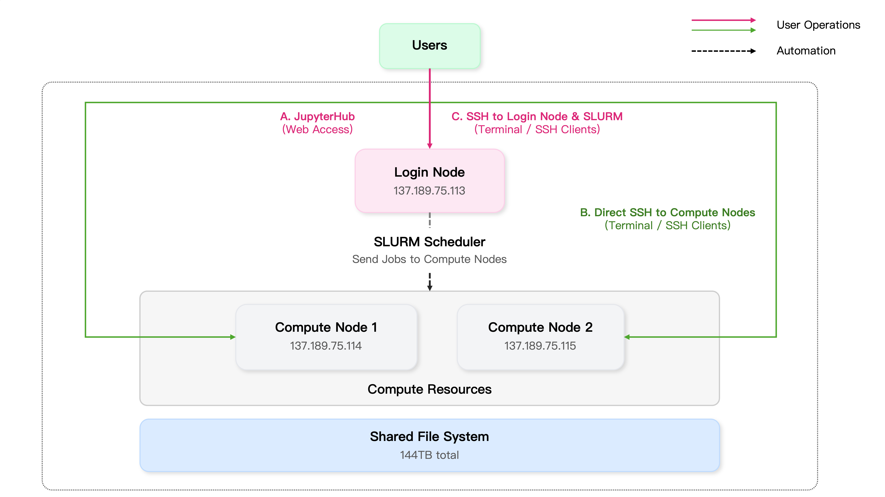
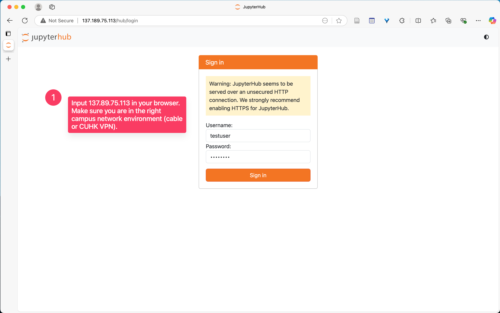
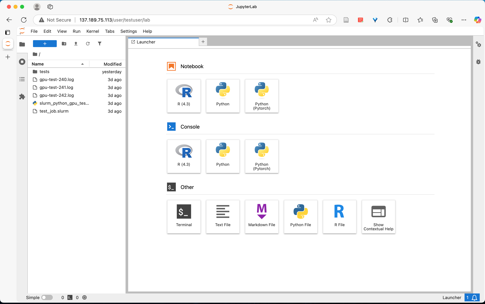
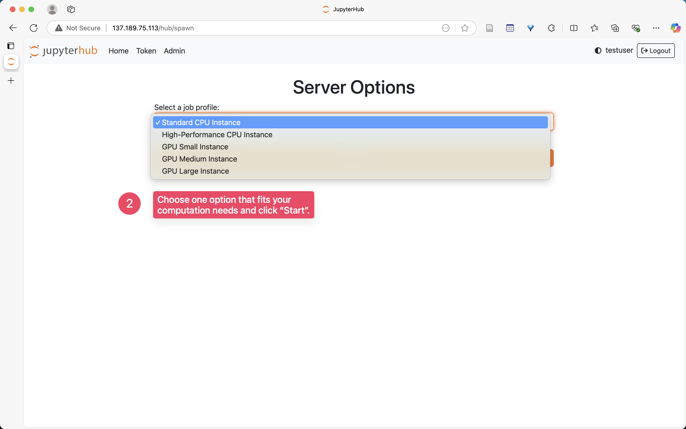

# CUHK Business School DOT HPC


[[**Create Account / Reset Password**](https://forms.gle/ghY9dEvQY1548kmK7)] [[**Report Issue**](https://docs.google.com/forms/d/e/1FAIpQLSfEhb-JFyDJY4YJZTm_8JhlqI9xnspSksopMaF1Cem5TAclyw/viewform?usp=sf_link)] [[**Deposit Datasets on CUHK Data Repository**](https://github.com/qcbegin/cuhkbiz-data-repo-guide)]
<br></br>


This repository provides an overview of servers in the Department of Decisions, Operations and Technology, CUHK Business School, including two GPU servers for computation and one server for storage and login (IP address: 137.189.75.113). 

The cluster is designed to support research requiring significant computational resources, such as machine learning, data analytics, optimization algorithms, and simulation modeling. With a total of 16 high-performance GPUs, 128 CPU threads, and 144TB of storage, the system provides (relatively) substantial computing power for department research needs.

> [!IMPORTANT]
> For now, only the faculty and PhD Students of the Department of Decisions, Operations and Technology are allowed to apply for an account. If you are a CUHK affiliate, please ask your collaborating faculty of the DOT department to apply for an account on your behalf.

Our HPC system follows a shared resource model that balances flexibility with efficiency:

- Each user has an independent base environment that can be customized according to specific research needs
- The SLURM scheduling system ensures fair allocation of computational resources among all users
- A unified file system allows seamless access to your files from any node in the cluster

If you encounter any issues with the system or have specific customization requests, please contact the administrator via [this support form](https://docs.google.com/forms/d/e/1FAIpQLSfEhb-JFyDJY4YJZTm_8JhlqI9xnspSksopMaF1Cem5TAclyw/viewform?usp=sf_link). We maintain a regularly updated [troubleshooting document](https://github.com/QiansiqiHu/DOT-server/blob/main/Jupyter_env.pdf) that addresses common installation and configuration issues.
<br></br>
> **Latest Update on Server Status:**
>
> [May 7, 2025]
> Our GPU servers have been unavailable for the past two days. Users who logged in may have been unable to access their notebooks (always pending in queue). We're pleased to report that one server is now operational and JupyterHub access has been restored. We will notify all users when server 115 returns to service.
>
> [March 24, 2025]
> The old JupyterHub service on 115 has been shut down. Please stop using the old login credentials and switch to the new ones instead. The JupyterHub service on 113 is now operational after its scheduled maintenance period (1:30 - 2:00 PM).
>
> [March 19, 2025]
> GPU card issue resolved: The previously missing GPU card is now functioning properly. We apologize for any inconvenience caused by the unexpected server shutdown resulting from our miscommunication.
>
> [March 18, 2025]
> We've identified that one GPU card is missing from node 115. Our team is currently working with IT staff to inspect the physical connection. Once we identify the issue, a system reboot may be necessary. We will notify all users before any scheduled downtime.
>
> [March 3, 2025]
> We have completed the service upgrade and data migration. Our new high-performance computing (HPC) cluster now integrates the computational resources of two GPU servers with a centralized storage and management system. Existing users can access the cluster through IP address 137.189.75.113 via web browser (JupyterHub) or SSH connections. To minimize disruption, we've created backups of your previous working folders. You can find these backups as a compressed archive or a folder with timestamps indicating when they were created. If no major issues arise during the **pilot phase (by Mar 23)**, we plan to discontinue the existing JupyterHub service on 115.
>
> [January 20, 2025]
> The server (137.189.75.115) has been successfully restored. All services are up and running.
>
> [January 18, 2025]
> IP address 137.189.75.115 is currently inaccessible from campus network (both browser and SSH connections affected). We are working with IT staff to identify and > resolve the connectivity issue. We will notify all users once service is restored.
> <br></br>

## Quick Start

Go to ["Using the HPC Cluster"](#using-the-hpc-cluster) directly and follow [Method 1](#method-1-web-access-jupyterhub) to use Python and R.


## Our HPC Cluster

Here’s a summary of the total computing resources available in our HPC cluster:

| Resource         | Quantity                     |
| ---------------- | ---------------------------- |
| CPU              | 64 cores, 128 threads        |
| RAM              | 96GB (32GB DDR4 + 64GB DDR5) |
| GPU              | 16 NVIDIA RTX 4090           |
| Storage          | 144 TB (18TB × 8 drives)     |
| Operating System | Ubuntu 22.04.4 LTS           |


### Components

Our cluster consists of two types of computer servers at this moment:

- *Login nodes* handle user login, light computation, and storage.
- *Compute nodes* handle heavy computation.



You will spend most of your time interacting with our **login node (113)**, including using JupyterLab and uploading your files and codes. As all nodes share a common file system, your files will be available everywhere even though you are only uploading them to a login node.


> [!TIP] 
> For SSH Users: If you are comfortable using SSH to connect to servers and prefer a straightforward approach without needing to learn advanced resource management tools like SLURM (which involves learning costs of using `srun` and `sbatch` commands to send your computation tasks to available compute nodes), you can directly use these compute nodes for your experiments.   


#### Compute Nodes (137.189.75.114 & 137.189.75.115)

These two servers are equipped with graphics cards (NVIDIA 4090). You may use them for computational experiments. Below is the summary of these two servers. They are identical in configuration. 

|Component| Description|
|---------|------------|
|Operating System       |Ubuntu 22.04.4 LTS|
|RAM                    |32GB DDR5-4800 ECC RDIMM [x16]|
|CPU|Intel® Xeon® Gold 5416S 30M Cache, 2.00 GHz (16C32T) [x2]|
|GPU|NVIDIA GeForce RTX 4090 24GB (CUDA 16,384 / Tensor 512) [x8]|

#### Login Node (137.189.75.113)

This server is used for login and your data storage. You can do light computations on this server, but since they are shared by all users and many services are running on it, this is NOT RECOMMENDED.

|Component| Description|
|---------|------------|
|Operating System| Ubuntu 22.04.4 LTS |
|RAM| 32GB DDR4-3200 ECC RDIMM [x1] |
|CPU| Intel® Xeon® Silver 4309Y 12M Cache, 2.80 GHz (8C16T) [x1] |
|Storage|18TB SAS 12Gb/s 7.2K rpm Seagate Enterprise [x8]|

## Supported Software

| Software | Jupyter Notebook | Console | Desktop Interface |
| -------- | ---------------- | ------- | ----------------- |
| Python   | Yes              | Yes     | -                 |
| R        | Yes              | Yes     | No                |
| Stata    | No               | -       | No                |
| MATLAB   | No               | No      | No                |

### Python and R

Python is fully supported on our GPU servers and ready to use immediately through either Jupyter Notebook or command line interface. R is also available to all registered users through the same interfaces (See this [guide](R_guide.md) for more instructions if you have no prior experience to use R in Jupyter). 

### Additional Software Requests

If you need access to other software packages (such as `MATLAB`), please submit your request through [our form](https://docs.google.com/forms/d/e/1FAIpQLSfEhb-JFyDJY4YJZTm_8JhlqI9xnspSksopMaF1Cem5TAclyw/viewform?usp=sf_link). We regularly review all software requests to better accommodate our users' research needs.

## Using the HPC Cluster

Our HPC cluster offers two main methods of access, designed to accommodate users with varying levels of technical expertise.

### Account Registration

To access our GPU servers, simply complete our [**registration form**](https://forms.gle/ghY9dEvQY1548kmK7). You'll receive your login credentials via email once your registration is approved.

### Network Prerequisite

Please make sure that the internet cable (in CYT) is available at your workplace OR that you have connected onto the [CUHK VPN service](https://www.itsc.cuhk.edu.hk/all-it/wifi-and-network/cuhk-vpn/). Otherwise, you will NOT be able to connect to the server for safety reasons.

If you're accessing the server from mainland China, you'll need the CUHK add-on VPN service for a stable connection. You can request this service through [this link](https://cuhk-edt.knowledgeowl.com/docs/pilot-cuhk-vpn-add-on-service). After approval, you'll receive an email with a specific portal address - use this instead of the standard VPN portal (access.cuhk.edu.hk).

### Method 1. Web Access (JupyterHub)

Using Jupyter requires only a browser—no special software installation needed. Follow these steps to begin working with our GPU resources:

> [!Note]
>
> Each user's Jupyter server will automatically terminate after 3 days. For longer tasks that may exceed this time limit, we recommend either: adding periodic save points in your scripts, or using Method 2 (SSH connection) instead, which doesn't have this time limitation.

1. In your web browser, navigate to `137.189.75.113`. You'll see the following login page:



2. Enter your username and password to log in. Wait a few seconds for your Jupyter server to start. You'll then see the familiar JupyterLab interface:

> [!NOTE]
> You may see a `"Pending in Queue"` message. This indicates that your requested resources are not currently available. You can either select a lighter resource option or wait until you receive a notification that your server is ready.



By default, a **Standard CPU** setup will be automatically selected. If you would like to use other options, follow these steps:

1. Click "File -> Hub Control Panel" to access the server control page
2. Click "Stop My Server"
3. Then click "Start My Server"
4. You'll now see various computing environment options
5. Select the resource configuration that best fits your requirements

| Option                    | **Description**                                      | **Max CPU Power** | **Max RAM** | **GPU Available** |
| ------------------------- | ---------------------------------------------------- | ----------------- | ----------- | ----------------- |
| **Standard CPU Instance** | Suitable for general data analysis and computations  | 8 cores           | 32GB        | No GPU            |
| **High-Performance CPU**  | For large-scale computing and intensive data tasks   | 32 cores          | 64GB        | No GPU            |
| **Small GPU Instance**    | Designed for deep learning with a single GPU         | 8 cores           | 32GB        | 1 GPU             |
| **Medium GPU Instance**   | For mid-sized deep learning tasks with 2 GPUs        | 16 cores          | 48GB        | 2 GPUs            |
| **Large GPU Instance**    | High-performance setup for large-scale deep learning | 32 cores          | 64GB        | 4 GPUs            |




3. You're now ready to start coding! We've provided two pre-configured conda environments for easy access (see installed libraries [here](./conda_envs.md)). Simply click one of the two Python buttons under "Notebook" to begin.

> [!TIP]
> If you need a customized environment, you can create your own conda environment in a terminal by following the procedures described in the ["Custom Conda Environment"](#custom-conda-environment) section.

### Method 2. SSH

SSH connection offers the most powerful and flexible way to work with our GPU servers, especially for computationally-intensive research projects. The same username and password will be used.

> [!NOTE]
> If you choose to bypass our web-based JupyterHub service and connect via SSH directly, please first launch JupyterHub once to initialize the conda environments. Without this step, you may encounter errors indicating that the conda command or `.bashrc` file cannot be found.

#### Recommended SSH Workflow

1. **Connect to the cluster** - We recommend connecting directly to the compute nodes (137.189.75.114 or 137.189.75.115) rather than the login node, as the compute nodes have significantly more processing power.
2. **Development environment** - Use VSCode Remote SSH or similar tools for code editing, which provides a familiar interface with syntax highlighting, code completion, and integrated terminal.
3. Running your code. Two options are provided:
   - **SLURM jobs (Recommended)**: Use the `sbatch` command to submit jobs with specific resource requirements. This allows for efficient resource allocation and lets your jobs run even when you're disconnected. [Learn more about SLURM commands here](#running-time-consuming-scripts-efficiently-through-slurm).
   - **Direct execution**: For quick tests, you can run Python scripts directly on the compute nodes.

> [!IMPORTANT]
> Please avoid running intensive computational tasks on the login node (137.189.75.113), as it has limited CPU resources and is shared by all users for administrative purposes.

#### Connection Methods

- For Beginners: We recommend using VSCode, which provides a familiar graphical interface while maintaining all the benefits of SSH connection. It lets you edit code, manage files, and monitor your programs through a single window.
- For Advanced Users: Command-line SSH gives you complete control over your server environment and may be more efficient for experienced users.

See our detailed [SSH connection guide](./SSH_access.pdf) for step-by-step instructions for both methods.

## Tips for Users

### File Storage and Transfer

Each user has a dedicated home directory located at `/mnt/disk5/home/username`. We've unified the storage system so you'll automatically access the same home directory whether connecting through SSH or JupyterHub on any node in our HPC cluster. This eliminates previous confusion with separate folders for different access methods.

> [!NOTE]
> **Storage Limit:** While we will start to conduct weekly backups of your files for data protection, each user has a 2TB storage limit. This ensures optimal performance for all users sharing the cluster resources.

#### Using JupyterHub (Beginner-Friendly)

When using JupyterHub's web interface, file transfer is straightforward:

- To upload: Simply drag and drop files from your computer into the JupyterHub file browser
- To download: Right-click on any file and select 'Download'
- Batch download: Click the right panel and find the extension manager, install the extension [`jupyter-archive`](https://github.com/jupyterlab-contrib/jupyter-archive). After restarting your Jupyter server (save your work first!) you'll find a new option called "Download as an archive" when you right-click a folder or multiple selected files.

#### Using SSH Commands (Command Line)

For larger files or batch transfers, SSH commands provide efficient file transfer:

```bash
# Upload a file from your computer to the server
scp /path/to/local/file username@137.189.75.115:/path/on/server

# Upload an entire folder
scp -r /path/to/local/folder username@137.189.75.115:/path/on/server

# Download a file from server to your computer
scp username@137.189.75.115:/path/on/server/file /path/on/your/computer

# Examples:
scp data.csv xinyuli@137.189.75.115:/mnt/disk5/home/xinyuli/datafolder
scp -r codes/ xinyuli@137.189.75.115:/mnt/disk5/home/xinyuli/project/
```

> [!NOTE]
> Replace 'username' and 'server' with your actual login credentials and server address.

#### Alternative Methods

- **WinSCP**: A user-friendly graphical tool for Windows users that provides drag-and-drop file transfer
- **Downloading from Web**: To download files directly to the server, use the `wget` command:

```bash
wget https://example.com/dataset.zip
```

### Custom Conda Environment

Use `conda`, an environment and library management toolkit that allows you to have separate workspaces with different libraries equipped. Each user's environments are independent. Open your terminal and follow these steps to configure your own environments.

```bash
# Source your .bashrc to initialize conda if you don't see "(base)" in your prompt
# Please first launch JupyterHub once to initialize the conda environments.
# Without this step, you may encounter errors indicating that `.bashrc` file cannot be found.
# Add conda to your PATH if it is not available: export PATH="/mnt/disk5/software/miniconda3/bin:$PATH"`
. ~/.bashrc
conda activate

# The shell prompt will change from:
username@hostname:~$
# to:
(base) username@hostname:~$

# Create a new conda environment with Python and essential packages
# Important: Always include Python and pip when creating a new environment
conda create -n myenv python=3.13 pip

# Activate your new environment
conda activate myenv

# The shell prompt will change to:
(myenv) username@hostname:~$

# Before installing packages, verify you're using the correct pip
which pip
# Should show: /mnt/disk5/home/username/.conda/envs/myenv/bin/pip

# Install packages in your environment
pip install package-name

# Verify packages are installed in your conda environment (not in .local)
pip show package-name
# Should show path in your conda environment: /mnt/disk5/home/username/.conda/envs/myenv/...

# Add your environment as a Jupyter kernel (run this command in base env)
python -m ipykernel install --user --name myenv --display-name "Python (myenv)"
```

Some useful conda commands:

```shell
conda env list          # list all environments
conda list             # list all packages in current environment
conda remove -n <env-name> --all  # remove an environment
conda deactivate       # return to base environment
```

> [!NOTE] 
>
> - Two shared environments are available by default (read-only):
>
>   - `base`: Basic data analysis environment
>
>   - `pytorch`: Deep learning environment with PyTorch
>
> - If packages are installing to `.local` directory instead of your conda environment, check which pip you're using with `which pip`
> - Always ensure you've activated your environment before installing packages

### Running Time-consuming Scripts Efficiently through SLURM

SLURM (Simple Linux Utility for Resource Management) is a job scheduling system designed for HPC clusters. Its primary purpose is to efficiently allocate resources and prevent competition for computing power when multiple users run jobs simultaneously.

> [!NOTE] 
>
> Using SLURM is **recommended but optional** for users who want more stable and flexible resource assignment. It's particularly valuable for long-running tasks and jobs requiring specific GPU allocations.
>
> If your code requires GPU resources or will run for extended periods, we highly recommend using SLURM. It ensures your tasks run smoothly without resource conflicts and allows you to disconnect while your job continues running. 

For detailed usage instructions, see the [Slurm official documentation](https://slurm.schedmd.com/documentation.html). Below we provide a quick start guide:

1. Create a job script (example: *my_job.sh*):

```bash
#!/bin/bash
#SBATCH --job-name=my_task       # Name for your job
#SBATCH --ntasks=1               # Number of tasks
#SBATCH --cpus-per-task=2        # CPUs per task
#SBATCH --gres=gpu:1             # Request 1 GPU per node
#SBATCH --nodes=2								 # Request 2 compute nodes
#SBATCH --time=2-00:00:00        # Request 2 days runtime (D-HH:MM:SS)
#SBATCH --output=%j_output.log   # Save output to a log file

# Your commands below
python /path/to/your/script.py
```

The `#SBATCH` lines specify resource requests and job parameters. For more options, see [this cheatsheet](https://slurm.schedmd.com/pdfs/summary.pdf).

> [!TIP]
> To request specific GPU resources, add:
>
> - `--gres=gpu:n` for n GPU per node
> - `--nodes=2` for 2 compute nodes
>
> The combination of the above two commands requests n*2=2n GPUs. For each user, we currently allow up to 12 GPUs.
>
> When requesting multiple GPUs with SLURM, your Python code must be configured to use them. For PyTorch users, you'll need to explicitly enable multi-GPU training (using `nn.DataParallel`, `nn.parallel.DistributedDataParallel`

2. Now submit your job:

```bash
  sbatch my_job.sh
```

Your code will run based on available resources, even if you disconnect from the cluster. The maximum job duration is 5 days.

> [!NOTE]
> When you connect via SSH, you'll be in the base conda environment by default. SLURM jobs will run in your currently activated conda environment, so make sure to activate the appropriate environment before submitting jobs if needed.

3. Monitor your job:

   ```bash
   squeue -u $USER       # List your running jobs
   scancel <job_id>      # Cancel a specific job
   ```

4. Alternative for shorter tasks: For quick tests or interactive sessions, you can use:

   ```bash
   srun --gres=gpu:1 --pty bash    # Get an interactive shell with 1 GPU from a single node
   ```

> [!NOTE]
> The `srun` command creates an interactive session that requires you to stay connected. If your SSH connection drops, your job will terminate immediately. For longer tasks or when you need to disconnect, always use `sbatch` instead.


## Contact

If you have any additional questions about the DOT-Server of CUHK Business School, please contact us at dotserver@cuhk.edu.hk.
